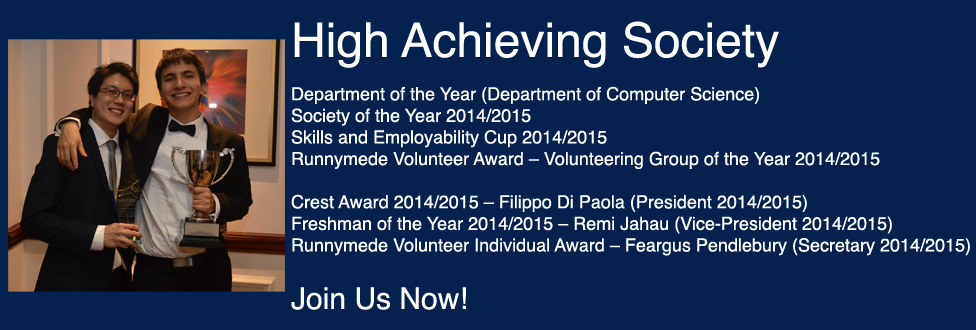

## High Achieving Society
- Department of the Year - **Department of Computer Science**
- Society of the Year 2014/2015
- Skills and Employability Cup 2014/2015
- Runnymede Volunteer Award - **Volunteering Group of the Year 2014/2015**

### Individual Awards
- Crest Award 2014/2015 - **Filippo Di Paola**
- Freshman of the Year 2014/2015 - **Remi Jahau**
- Runnymede Volunteer Individual Award - **Feargus Pendlebury**

