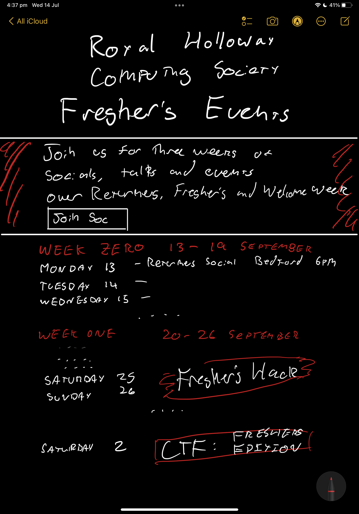

import Section from "../../../components/Section";
import HeroSection from "../../../components/HeroSection";
import SiteButton from "../../../components/SiteButton";
import { FreshersPictureHeroSection } from "../../../components/FreshersPictureHeroSection";
import { freshers2021table, middleCell, freshers2020freshershacklogo, noBottom } from "./index.module.scss";
import logo_var_orange from "./logo_var_orange.png";

<FreshersPictureHeroSection />

<Section
  name="Welcome to Royal Holloway"
  tag="Join us for three weeks of socials, talks and events over fresher's, returner's and welcome week."
  theme="orange"
>
  <SiteButton
    className="btn-solid-red m-2"
    href="https://www.su.rhul.ac.uk/societies/a-z/computing/"
  >
    get membership @ su.rhul.ac.uk
  </SiteButton>
</Section>

<Section
  tag="Schedule"
  theme="orange"
>
  <table className={freshers2021table}>
    <tbody>
      <tr className={noBottom}>
        <td colspan="3">
          <h2>Week Zero ~ 13-20 September</h2>
        </td>
      </tr>
      <tr>
        <td>Monday 13</td>
        <td className={middleCell}>Returners Social Bedford</td>
        <td>6pm</td>
      </tr>
      <tr>
        <td>Tuesday 14</td>
      </tr>
      <tr>
        <td>Wednesday 15</td>
      </tr>
      <tr>
        <td>Thursday 16</td>
      </tr>
      <tr>
        <td>Friday 17</td>
      </tr>
      <tr>
        <td>Saturday 18</td>
      </tr>
      <tr className={noBottom}>
        <td>Sunday 19</td>
      </tr>
      <tr className={noBottom}>
        <td colspan="3">
          <h2>Week One ~ 20-26 September</h2>
        </td>
      </tr>
      <tr>
        <td>Monday 20</td>
      </tr>
      <tr>
        <td>Tuesday 21</td>
      </tr>
      <tr>
        <td>Wednesday 22</td>
      </tr>
      <tr>
        <td>Thursday 23</td>
      </tr>
      <tr>
        <td>Friday 24</td>
      </tr>
      <tr>
        <td>Saturday 25</td>
        <td rowspan="2" className={middleCell}>
          
        </td>
        <td>
          11am to 10pm
        </td>
      </tr>
      <tr className={noBottom}>
        <td>Sunday 26</td>
        <td>
          11am to 10pm
        </td>
      </tr>
      <tr className={noBottom}>
        <td colspan="3">
          <h2>Week Two ~ 27 September - 03 October</h2>
        </td>
      </tr>
      <tr>
        <td>Monday 27</td>
        <td className={middleCell}>Whatever Social Chelmsford</td>
        <td>6pm</td>
      </tr>
      <tr>
        <td>Tuesday 28</td>
        <td className={middleCell}>Something Else Slough</td>
        <td>25pm</td>
      </tr>
      <tr>
        <td>Wednesday 29</td>
      </tr>
      <tr>
        <td>Thursday 30</td>
      </tr>
      <tr>
        <td>Friday 01</td>
      </tr>
      <tr>
        <td>Saturday 02</td>
      </tr>
      <tr className={noBottom}>
        <td>Sunday 03</td>
      </tr>
    </tbody>
  </table>
</Section>

<!--  -->

<!-- None of this will be rendered until you turn on "render: true" -->
