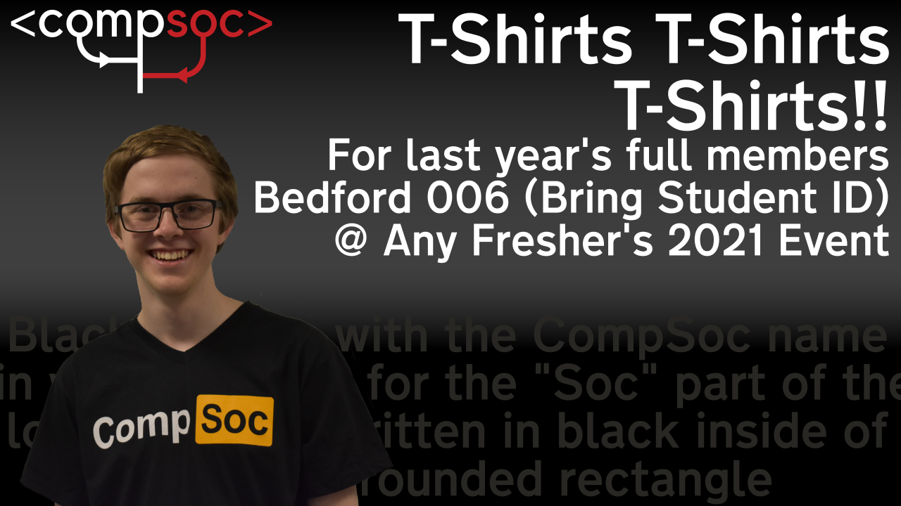

import { SiteLink, SiteButton } from "@components/SiteClickable";

# CompSoc Memberships are back open!

Welcome back! Hope you had a nice long break, ready to move back into in person teaching.
We've done a lot of work and preparation to bring you some great events, not only for [Fresher's Week 2021][1], but for the rest of the year.

## Code of Conduct

We've recently had issues with a minority of students being disruptive to CompSoc. This is a reminder for everyone, not just students of Royal Holloway, that you must adhere to the RHSU, RHUL, and CompSoc _Rules_ and _Code of Conduct_

If you have any issues with any other members and/or committee members, feel free to message any member of the 2021 to 2022 committee, or e-mail us at <conduct@computingsociety.co.uk>

## Membership

This year, the CompSoc memberships are set at £8 for full membership, or £2 for a social membership.
You can come to all events with any membership, but the ✨ **_*full*_** ✨ membership grants you access to swag like T-Shirts, bottles and more!

[**Sign up for CompSoc membership @ su.rhul.ac.uk**][2]

## Black T-Shirt with CompSoc, but the `Soc` is written in black inside of an orange rounded rectangle (for Last Year's Members)

Last year, we committed to give out our remaining stock of CompSoc branded "orange rounded rectangle" t-shirts. Unfortunately, due to the coronavirus, we were not able to give these out.
We are happy to announce that you will finally be able to collect your T-Shirts.

1. Come to the Bedford Building for any of our [Fresher's Week][1] events!
1. Bring your Student ID with you for us to check who you are
1. Grab a _totally not suspicious_ black T-Shirt with CompSoc written on it, but the `Soc` part of the CompSoc logo is written in black text in the orange round rectangle.

Unfortunately, we currently do not have any plans to ship out shirts to those who have already left the university. If there is enough interest, we may consider doing so.

## Thanks!

Thank you for your support of the Computing Society.
If you have any additional ideas and suggestions, why not let us know [via our Suggestions Form][3]

[1]: /events/freshers2021
[2]: https://www.su.rhul.ac.uk/societies/a-z/computing/
[3]: https://suggest.cmpsc.uk/
